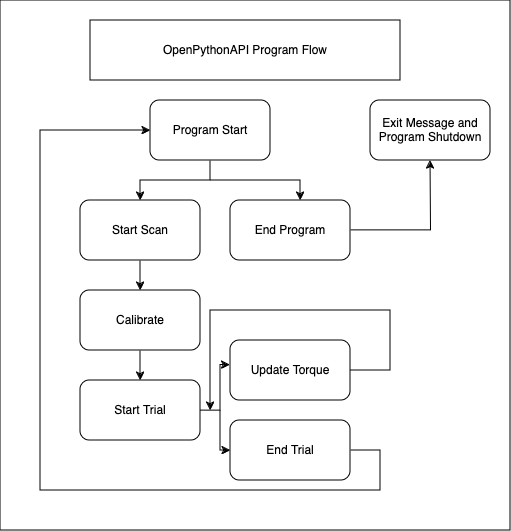
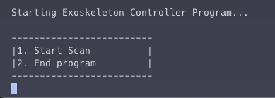
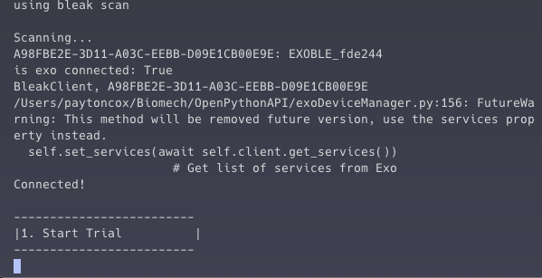
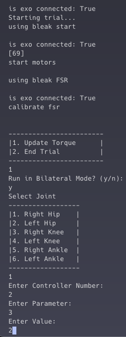
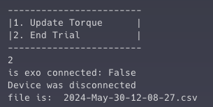

# OpenPythonAPI
## Overview

This program can be ran via any computer/terminal with python 3.12 installed. Libraries needed can be installed via pip (python's module manager)

Open source API (application programming interface) writen in Python for controlling the NAU Biomechatronics Lab's OpenExo system.

This project uses the MIT License.

The purpose of this project is to provide an open source solution for controlling the OpenExo system that is accessible to anyone and free to modify for their needs.

## Libraries Needed

BLE (Bluetooth Low Energy) is the heart of this project which provides a connection from this API to the exoskeletons. Bleak, a python library is used to handle all BLE operations. To find out more about Bleak click [here](https://bleak.readthedocs.io/en/latest/).

## Operation of API
### Program control flow

This program runs in the command line with the system's keyboard as the input. Ensure Bluetooth is turned on before running the program. 

To start the program run the command in any terminal `python3 openPythonApi` which is where main() is found

*Start Scan*, a menu option on program startup, will begin a scan of all bluetooth devices that match the exoskeleton's UUID.

There is a setup process for the device to calibrate and then the user will have the option to *Start Trial*

Once a trial has begun, the program operates under a loop with the option to update torque or end trial. The loop will continue until end trial is selected. Ending a trial generates a csv in the folder where the API is running named with the date and time containing all the exoskeleton data collected during the trial.

*Update Torque* will display a menu to choose which joint to target, options to operate bilaterally, and input for controller ID, Parameter, and torque value to update as well.

